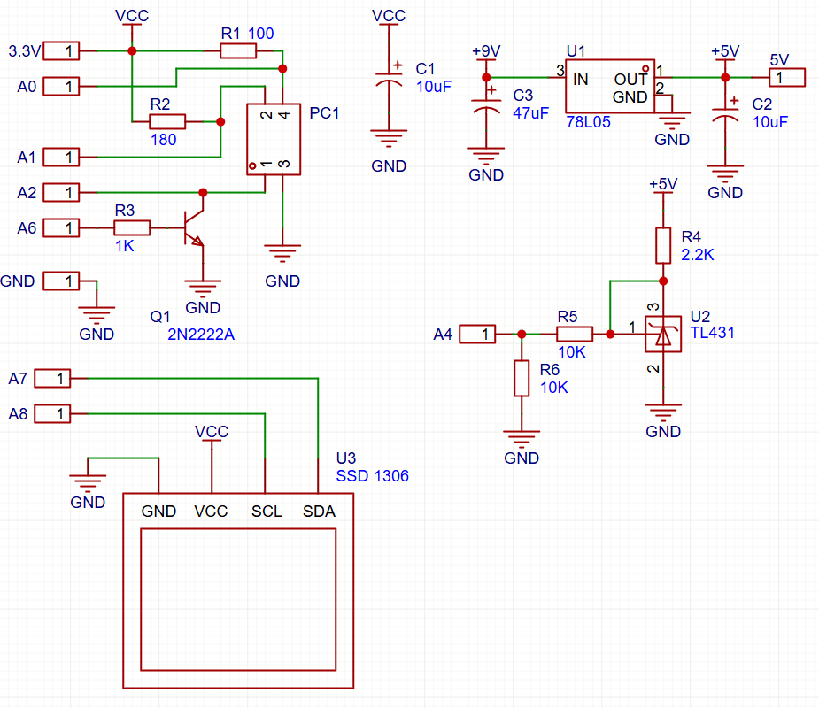

# STM32F411 Optocoupler (PC817) & TL431 Tester

A simple, open-source hardware tester built around the **STM32F411** microcontroller. This device tests and evaluates the functionality of **PC817 / L817 optocouplers** and **TL431 adjustable precision shunt regulators**, displaying real-time metrics on an **SSD1306 OLED display**.

---

## Features

* **PC817 / L817 Optocoupler Testing:** Tests input/output voltages and currents, calculates current transfer ratio (CTR) and measures dark $V_{\text{ce}}$.
* **TL431 Testing:** Measures reference voltage ($V_{\text{ref}}$) and verifies voltage regulation stability.
* **Display Interface:** Real-time feedback and diagnostic stats rendered on a 0.96" SSD1306 OLED screen (128 x 64 resolution).
* **Portable & Quick Diagnostics:** On-the-fly testing for salvage or component validation.

---

## Hardware Specifications

* **Microcontroller:** STM32F411 BlackPill / Custom Board (`STM32F411CEU6`)
* **Display:** SSD1306 OLED (128 x 64, I2C)
* **Tested Components:**
  * L817 / PC817 Optocoupler
  * TL431 / TL431A Programmable Shunt Regulator
* **Peripherals Used:**
  * I2C for OLED display
  * ADC1 for reference voltage measurements
  * GPIOs for switching

---

## Pinout / Wiring Diagram




## Getting Started

1. **Clone the Repository:**
   ```bash
   git clone [https://github.com/richardbodonyi/f411-l817-tester.git](https://github.com/richardbodonyi/f411-l817-tester.git)
