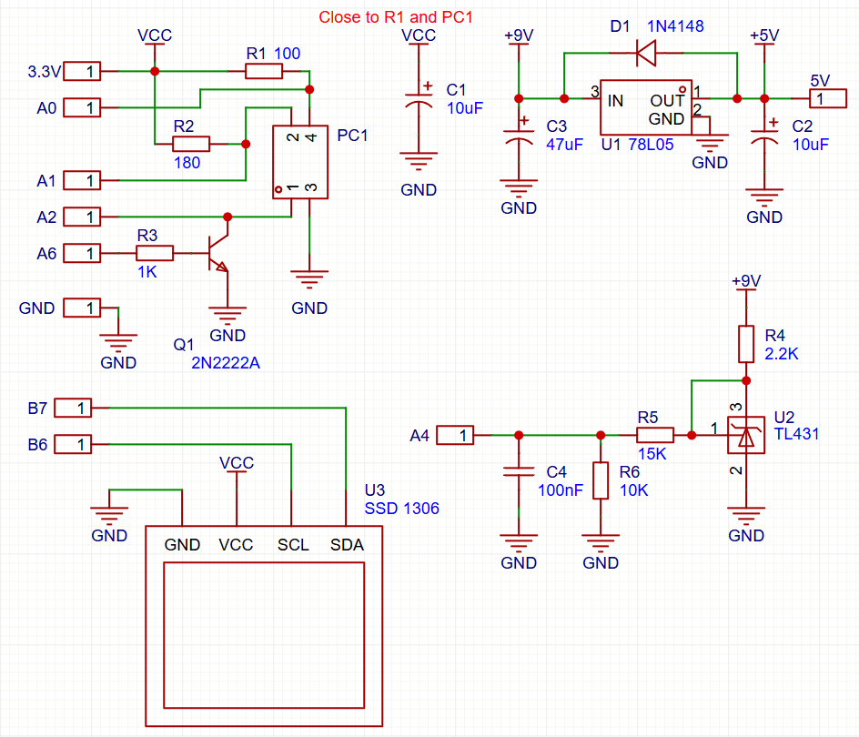
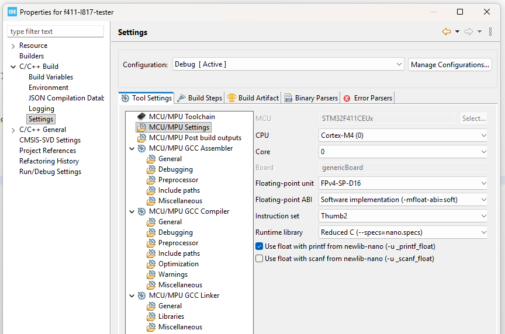
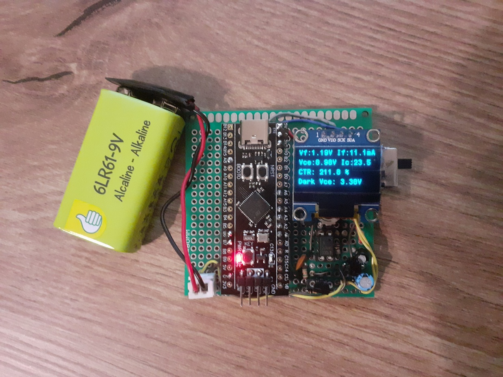
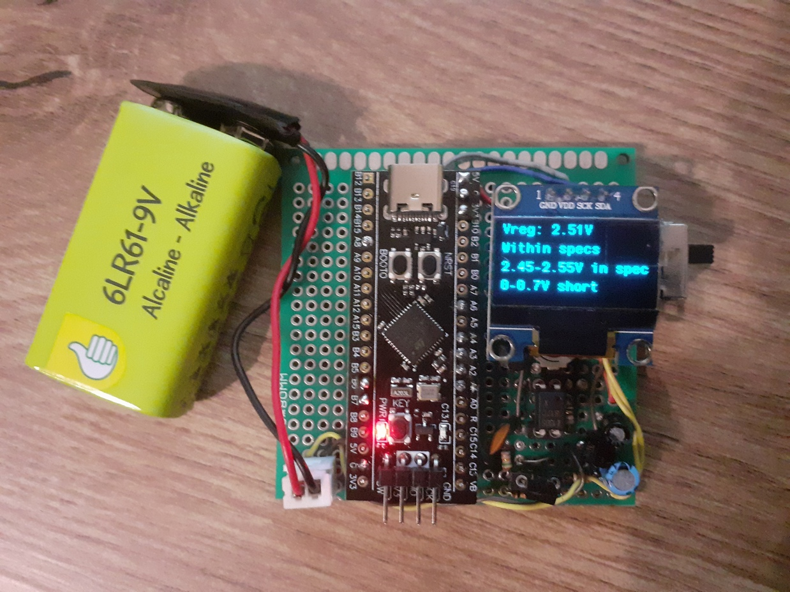

# STM32F411 Optocoupler (PC817 / L817) & TL431 Tester

A simple, open-source hardware tester built around the **STM32F411CEU6** microcontroller. This device evaluates the functionality of **L817 / PC817 optocouplers** and **TL431 precision adjustable shunt regulators**, displaying real-time metrics on an **SSD1306 OLED display**.

---

## Features

* **PC817 / L817 Optocoupler Testing:** Measures $V_{\text{f}}$, $I_{\text{f}}$, $V_{\text{ce}}$, and $I_{\text{c}}$ to evaluate Current Transfer Ratio (CTR) against a $130\% - 260\%$ standard. Performs dark $V_{\text{ce}}$ leakage tests to verify complete off-state isolation.
* **TL431 Regulator Testing:** Calculates regulated voltage $V_{\text{reg}}$ via a resistor divider and classifies components into **Within Specs** ($2.45\text{V} - 2.55\text{V}$), **Shorted** ($0\text{V} - 0.7\text{V}$), or **Degraded** states.
* **User Interface & Mode Selection:** Toggles between Optocoupler and Regulator measurement modes using a physical button tied to EXTI line 0 with a 150 ms software debounce lock.
* **Real-Time Visual Display:** Displays measurement pass/fail marks and diagnostic stats on a $0.96"$ SSD1306 OLED screen ($128 \times 64$, I2C).

---

## Hardware Specifications

* **Microcontroller:** STM32F411CEU6 (WeAct BlackPill / Custom Board)[cite: 5, 6]
* **Display:** SSD1306 OLED ($128 \times 64$, I2C1 on PB6/PB7)[cite: 5, 6]
* **Measurement Network Constants - adjust to your measured resistor values:**
  * Anode Resistor ($R_2$): $180\,\Omega$
  * Collector Resistor ($R_1$): $100\,\Omega$
  * Voltage Divider ($R_5, R_6$): $15\,\text{k}\Omega / 10\,\text{k}\Omega$

---

## Pinout Mapping

| Pin | Function / Peripheral | Description |
| :--- | :--- | :--- |
| **PA0** | `GPXTI0` (Input, Pull-Up) | Key / Mode Toggle Button (EXTI line 0) |
| **PA1** | `ADC1_IN1` | $V_{\text{ce}}$ Voltage Measurement |
| **PA2** | `ADC1_IN2` | $V_{\text{k}}$ Cathode Voltage Measurement |
| **PA3** | `ADC1_IN3` | $V_{\text{a}}$ Anode Voltage Measurement |
| **PA4** | `ADC1_IN4` | $V_{\text{reg}}$ TL431 Divider Measurement |
| **PA6** | `GPIO_Output` | Optocoupler LED Switch Control (`OP_ON`) |
| **PB6** | `I2C1_SCL` | OLED Display Clock |
| **PB7** | `I2C1_SDA` | OLED Display Data |

---

## Pinout / Wiring Diagram



---

## Getting Started

1. **Clone the Repository:**
   ```bash
   git clone https://github.com/richardbodonyi/f411-l817-tester.git

After importing the project make sure the build is configured to support floating point with printf in STM32CubeIDE.




## Prototype




